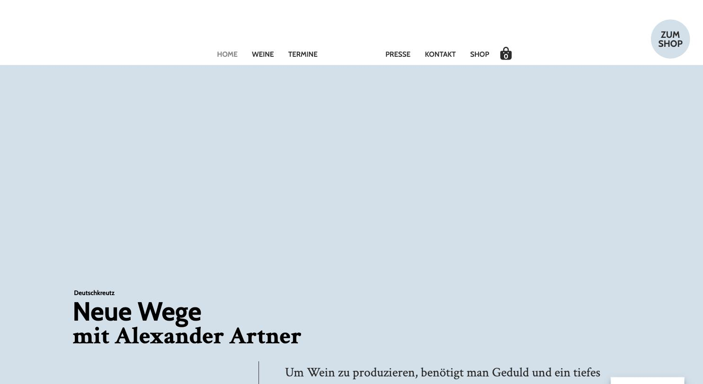
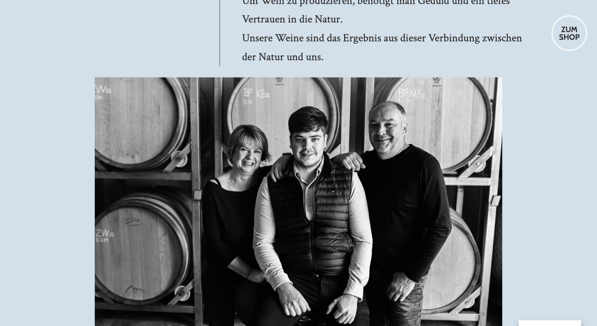

# Weingut Artner

**Mutige Farbe, umgekehrte Schriftlogik, wenig Substanz.**

- URL: https://weingut-artner.at/
- Kategorie: Shop / klein
- Plattform: WordPress + WooCommerce
- Premium-Eignung: 2/5

## Einschätzung

Auffällig ist die durchgehend hellblaue Grundfläche und die umgekehrte Schriftpaarung: eine sehr fette Grotesk (Cabin w900) für Headlines und eine Serif (Crimson Text) für den Fließtext – normalerweise andersherum. Das kann funktionieren, wirkt hier aber unfertig, weil kaum Inhalt vorhanden ist (Seitenlänge nur 2.433 px, ein einziges Foto) und große Flächen leer bleiben. Der Shop hängt als runder Badge oben rechts und ist inhaltlich abgekoppelt.

## Farbpalette

| Hex | Rolle |
|---|---|
| `#d0dfea` | Hellblau (Grundfläche) |
| `#ffffff` | Weiß |
| `#f7f4f2` | Warmes Weiß |
| `#2c2c2c` | Text |
| `#8a8785` | Sekundärtext |

## Typografie

Schriften: Cabin (Grotesk, w900) + Crimson Text (Serif, Body)

| Rolle | Spezifikation | Beispiel |
|---|---|---|
| H1 | `Cabin 56/56 px · w900 · schwarz` | Neue Wege mit Alexander Artner |
| H2 | `Cabin 35/35 px · w900` | Sektionstitel |
| Body | `Crimson Text 28/48 px · w400 · #2c2c2c` | Sehr großer Serif-Fließtext |

## Layout & Raster

Container 1200 px, Seitenlänge nur 2.433 px, Sektions-Padding 65 px. Viel ungenutzte Fläche zwischen den Blöcken.

## Bildsprache

Ein einziges großes Schwarzweiß-Familienporträt vor Holzfässern.

## Shop / Buchung

Runder „ZUM SHOP“-Badge (r 42 px) fix oben rechts, Warenkorb-Icon im Header.

## Bewegung

Keine nennenswerte.

## Übernehmen

- Schwarzweiß-Porträt der Familie als einziges Bild – hohe Wirkung durch Reduktion
- Farbige Grundfläche statt Weiß

## Vermeiden

- Serif für den Fließtext bei 28 px – schlecht lesbar auf Länge
- Große leere Flächen ohne gestalterische Absicht
- Shop als abgekoppelter Badge statt integrierter Bereich

## Screenshots

*Hellblaue Grundfläche, fette Grotesk-Headline, runder Shop-Badge*

*Schwarzweiß-Familienporträt vor Holzfässern*
