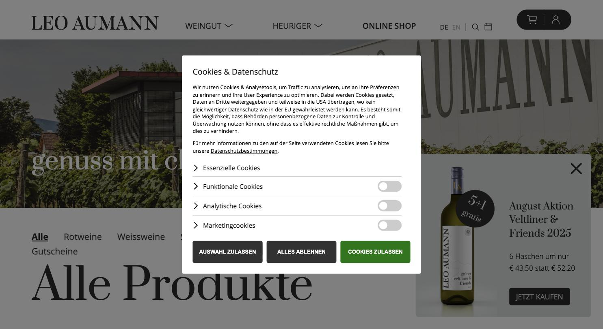
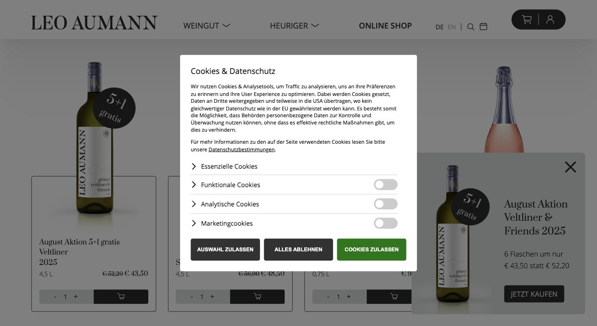

# Leo Aumann

**Sauberer Shop mit gutem Typo-Ansatz, kaputt gemacht durch Rabattlogik.**

- URL: https://www.aumann.at/de/weinshop/online-weinshop.html
- Kategorie: Shop
- Plattform: Individueller Shop
- Premium-Eignung: 3/5

## Einschätzung

Prata als Display-Serif über Vollbild-Landschaft plus Open Sans Light für den Fließtext ist eine tragfähige Kombination, und die Kachel mit dünner Umrandung ist ruhiger als die meisten Mitbewerber. Die Preisdarstellung mit durchgestrichenem Vorher-Preis, die schwarze „5+1 gratis“-Rosette und das Aktions-Popup ziehen den Auftritt aber sofort in Richtung Diskont. Burgunderrot taucht als Akzent auf, wird aber kaum genutzt.

## Farbpalette

| Hex | Rolle |
|---|---|
| `#2b2b2a` | Anthrazit (Basis) |
| `#d8dcdb` | Kühles Grau |
| `#651d32` | Burgunder (Akzent) |
| `#d0d3d4` | Linien |
| `#ffffff` | Weiß |

## Typografie

Schriften: Prata (Display-Serif) + Open Sans (Light/Regular/Semibold)

| Rolle | Spezifikation | Beispiel |
|---|---|---|
| H1 | `Prata 62/74 px · w400 · weiß auf Bild` | genuss mit charakter |
| H2 | `Prata 40/48 px · w400` | Alle Produkte |
| Body | `Open Sans Light 18/29 px · w300` | Fließtext |
| Nav | `Open Sans Semibold 15 px · UPPERCASE` | WEINGUT / HEURIGER / ONLINE SHOP |

## Layout & Raster

Vollbild-Hero mit Fassadenmotiv, darunter Filterzeile und Produktraster mit dünn umrandeten Kacheln. Seitenlänge 11.203 px.

## Bildsprache

12 Bilder, überwiegend 3:4. Architektur- und Weingartenmotive, freigestellte Flaschen im Raster.

## Shop / Buchung

Mengen-Stepper und dunkler Warenkorb-Button je Kachel, Literangabe, durchgestrichener Vorher-Preis, „5+1 gratis“-Rosette, Aktions-Popup, Kalender-Icon für den Heurigen, DE/EN.

## Bewegung

Zurückhaltend.

## Übernehmen

- Prata über Vollbild-Fassadenmotiv – wirkt in der Kombination hochwertig
- Dünn umrandete Produktkachel statt Schatten und Karte
- Kalender-Icon im Header für Heurigen-/Öffnungstermine
- Zweisprachigkeit sauber im Header

## Vermeiden

- Durchgestrichene Preise und „gratis“-Rosetten im Premiumsegment
- Aktions-Popup, das sich über das Produktraster legt
- Vierstufiger Cookie-Dialog mit grünem Zustimmen-Button

## Screenshots

*Vollbild-Hero mit Prata-Claim, darunter Filterzeile*

*Produktraster mit Steppern, Streichpreisen und Aktions-Popup*
