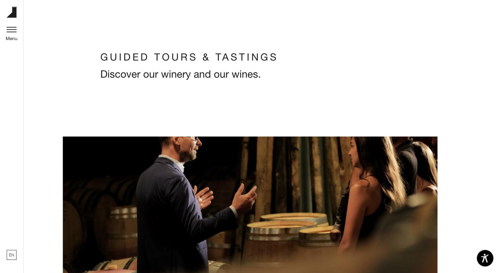
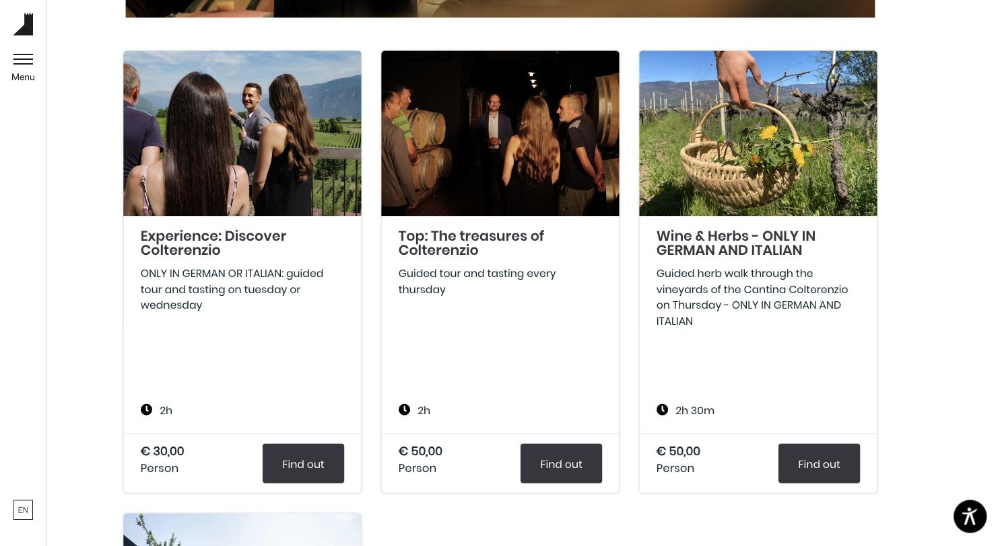

# Colterenzio — Führung & Verkostung

**Die beste Buchungsmechanik der Liste – emotional aber unterkühlt.**

- URL: https://www.colterenzio.it/fuehrung-verkostung/
- Kategorie: Erlebnis / Buchung
- Plattform: Individuell, dreisprachig
- Premium-Eignung: 4/5

## Einschätzung

Für die Frage „wie verkaufe ich Führungen und Verkostungen“ ist das die brauchbarste Referenz. Jede Erlebnisvariante ist eine eigene Karte mit demselben Aufbau: Bild, Titel, Beschreibung, Dauer mit Uhr-Icon, Preis pro Person, dunkler Button. Dadurch sind vier Angebote in Sekunden vergleichbar. Die Sprachhinweise („ONLY IN GERMAN AND ITALIAN“) stehen direkt in der Beschreibung – für ein Weingut mit internationalen Gästen wichtig. Gestalterisch ist es allerdings sehr nüchtern: weiß, Helvetica, kaum Emotion. Die feste Seitenleiste mit Logo, Menü und Sprachumschalter ist eine gute Lösung für mehrsprachige Auftritte.

## Farbpalette

| Hex | Rolle |
|---|---|
| `#ffffff` | Weiß |
| `#f5f5f5` | Kartenfläche |
| `#35373d` | Button dunkel |
| `#1e1e1c` | Text |
| `#8d8d8d` | Metadaten |
| `#162931` | Fließtext |

## Typografie

Schriften: Helvetica Neue LT (Headlines) + Poppins Light (Body)

| Rolle | Spezifikation | Beispiel |
|---|---|---|
| H2 | `Helvetica Neue LT 30/36 px · w400 · ls 6 px · UPPERCASE` | GUIDED TOURS & TASTINGS |
| H3 | `Helvetica Neue LT 31/37 px · w400` | Kartentitel |
| Body | `Poppins 16/24 px · w300 · #162931` | Beschreibung |

## Layout & Raster

Feste linke Seitenleiste (Logo, Menü, Sprache), Content rechts. Seitenlänge nur 2.273 px – bewusst kurz. Kartenraster 3-spaltig, Radius 6 px.

## Bildsprache

Reportagefotos der Führungen selbst: Menschen im Keller, im Weingarten, Kräuterkorb. Kein Stockmaterial.

## Shop / Buchung

Erlebniskarte mit fixem Aufbau: Bild 16:9 → Titel → Beschreibung → Uhr-Icon + Dauer → Preis „€ 50,00 / Person“ → dunkler Button „Find out“. Sprachhinweis direkt in der Beschreibung.

## Bewegung

Keine.

## Übernehmen

- Erlebniskarte mit immer gleichem Aufbau: Bild, Titel, Dauer, Preis pro Person, ein Button
- Dauer mit Uhr-Icon als eigenes Datenfeld
- Sprachhinweis direkt am Angebot
- Feste Seitenleiste mit Sprachumschalter für mehrsprachige Auftritte
- Bewusst kurze Seite (2.273 px) – Buchen statt Scrollen

## Vermeiden

- Helvetica mit 6 px Laufweite wirkt technisch, nicht gastlich
- Weiße Grundfläche ohne jede Markenfarbe
- Bilder laden verzögert nach – Platzhalter-Icons sind sichtbar

## Screenshots

*Seitenleiste links, gesperrte Versalzeile, Reportagebild der Führung*

*Erlebniskarten mit Dauer, Preis pro Person und einheitlichem Button*
