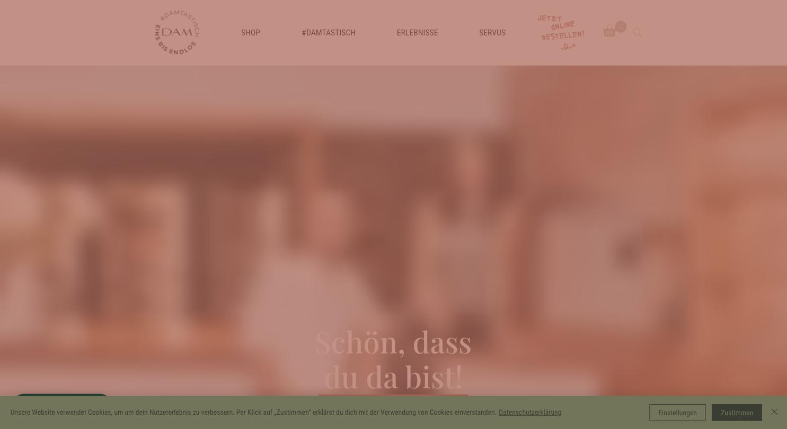
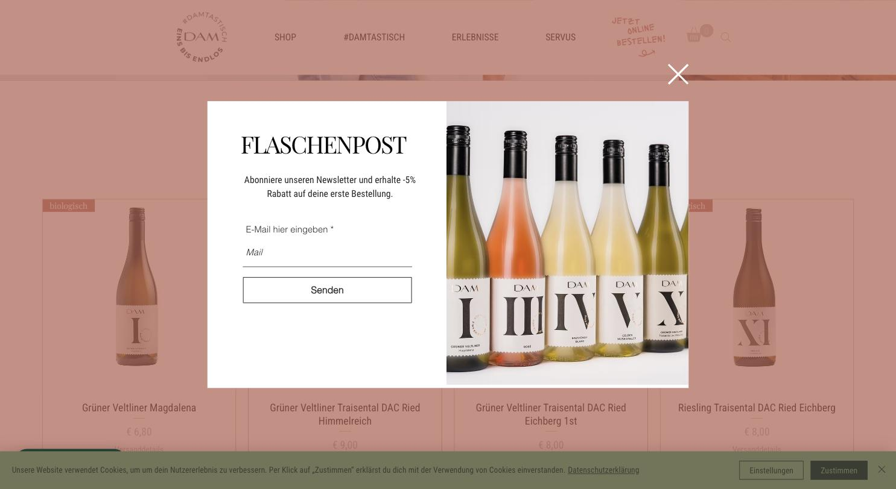

# Weingut & Vinothek Dam

**Freundlich, jung, aber sichtbar Baukasten.**

- URL: https://www.weingut-dam.at/
- Kategorie: Shop
- Plattform: Wix
- Premium-Eignung: 2/5

## Einschätzung

Terrakotta und warmes Weiß, Playfair Display für die Headlines, ein runder Stempel mit „#DAMTASTISCH – EINS BIS ENDLOS“ als Bildmarke. Die Tonalität ist bewusst locker („Schön, dass du da bist!“, „SERVUS“). Technisch ist es eine Wix-Seite, was man an den generischen Schriftreferenzen und der Struktur erkennt. Das Newsletter-Modal mit -5 % erscheint sofort. Für ein Premium-Weingut ist der Ton zu leger und der Aufbau zu wenig eigenständig.

## Farbpalette

| Hex | Rolle |
|---|---|
| `#b76354` | Terrakotta |
| `#cdc5bf` | Warmes Grau |
| `#fdfbf8` | Warmweiß |
| `#727557` | Olive |
| `#ffffff` | Weiß |

## Typografie

Schriften: Playfair Display (Headlines) + Wix-Systemschriften (Body)

| Rolle | Spezifikation | Beispiel |
|---|---|---|
| H1 | `Playfair Display 49 px · w400 · weiß auf Bild` | Schön, dass du da bist! |
| H2 | `Playfair Display 49 px · w400` | FLASCHENPOST |
| Body | `16/36 px · w400` | Fließtext mit sehr großer Zeilenhöhe |

## Layout & Raster

Seitenlänge 4.562 px. Zentrierter Vollbild-Hero, darunter Produktraster 4-spaltig mit „biologisch“-Tags.

## Bildsprache

Wenige eigene Bilder, dafür Flaschen-Gruppenaufnahme im Newsletter-Modal. Etiketten mit römischen Ziffern (I, III, IV, V, X) als eigenständiges Gestaltungselement.

## Shop / Buchung

Produktkacheln mit Name, Preis und Versanddetails, „biologisch“-Tag oben links, handgeschriebener Störer „JETZT ONLINE BESTELLEN!“, Newsletter-Modal mit -5 %.

## Bewegung

Wix-Standardanimationen.

## Übernehmen

- Römische Ziffern auf den Etiketten als Serien-System – überträgt sich gut auf die Website
- Runder Stempel als sekundäre Bildmarke

## Vermeiden

- Newsletter-Modal mit Rabatt direkt beim Einstieg
- Handgeschriebene Störer im Header
- Duz-Ansprache und Ausrufezeichen im Premiumkontext
- Sichtbare Baukasten-Struktur

## Screenshots

*Terrakotta-Header mit rundem Stempel und handgeschriebenem Störer*

*Produktraster mit Newsletter-Modal „FLASCHENPOST“ (-5 %)*
