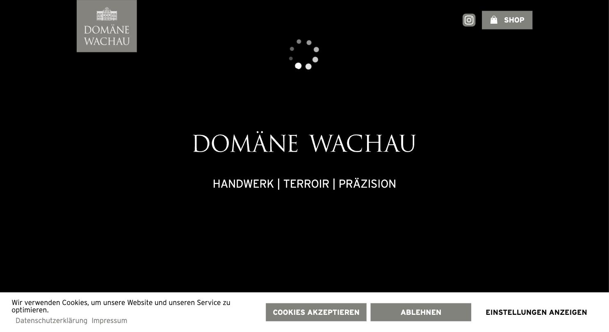
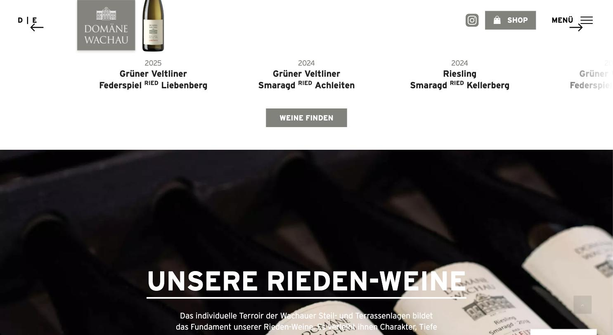
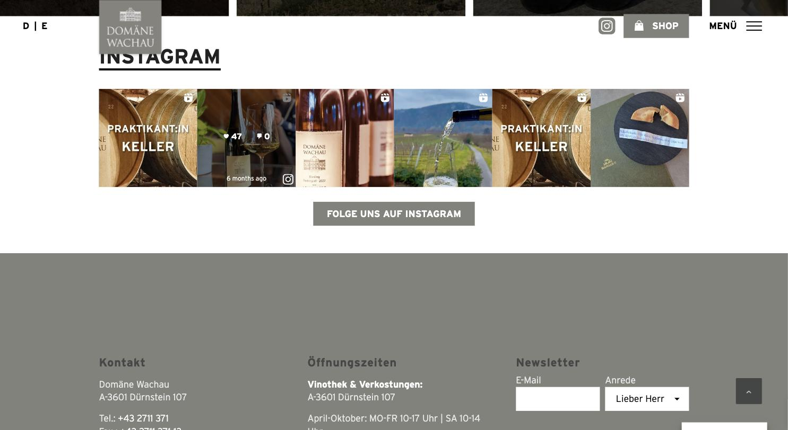

# Domäne Wachau

**Institution. Breit, laut, technisch solide – aber kein Premium-Gefühl.**

- URL: https://www.domaene-wachau.at/de/
- Kategorie: Marke + Shop
- Plattform: WordPress (Enfold) + WooCommerce
- Premium-Eignung: 3/5

## Einschätzung

Die größte und inhaltsreichste Seite der Liste. Der schwarze Intro-Screen mit dem gesetzten Logo verspricht Hochwertigkeit, danach kippt der Auftritt in einen sehr klassischen WordPress-Aufbau mit Instagram-Feed, Newsletter-Popup und Rabattlogik. Die Typografie besteht ausschließlich aus einer einzigen Grotesk (Interstate) – kein einziger Serif-Akzent außer im Logo. Für eine Genossenschaft mit dieser Größe stimmig, für ein Familienweingut im Premiumsegment deutlich zu breit und zu funktional.

## Farbpalette

| Hex | Rolle |
|---|---|
| `#0a0a0a` | Headline-Schwarz |
| `#282b2e` | Dunkelgrau Sektion |
| `#81827b` | Markengrau (warm) |
| `#82847f` | Fließtext-Grau |
| `#444444` | Body |
| `#f8f8f8` | Sektionsfläche |
| `#eeeeee` | Trennfläche |
| `#ffffff` | Grund |

## Typografie

Schriften: Interstate (einzige Textschrift, alle Schnitte)

| Rolle | Spezifikation | Beispiel |
|---|---|---|
| H1 | `Interstate 66/88 px · w700 · UPPERCASE` | Das Weingut |
| H2 | `Interstate 22/28 px · w700` | Zwischenüberschrift |
| H3 | `Interstate 20/20 px · w700 · UPPERCASE` | Label |
| Body | `Interstate 18/25 px · w400 · #444` | Fließtext im Content |
| Nav | `Interstate 18 px · w700 · UPPERCASE` | MENÜ / SHOP |
| Footer | `Interstate 11/10 px · w400` | Kleingedrucktes |

## Layout & Raster

Container bis 2180 px, Sektions-Padding 70–120 px, Seitenlänge 5.522 px. Vollbild-Intro mit Ladeanimation, danach klassische Sektionsfolge. Logo sitzt fix und überlagert beim Scrollen den Content.

## Bildsprache

27 Bilder, überwiegend 1:1 (13×) und 16:9 (9×), 1 Video. Dunkle Kellerfotografie, Porträt-Mosaik aller Weinhauer:innen, Drohnen-/Landschaftsmotive. Bildstimmung uneinheitlich.

## Shop / Buchung

WooCommerce mit Side-Cart. Shop-Button dauerhaft im Header, Flaschen-Karussell mit Jahrgang + Ried, CTA „WEINE FINDEN“. Rabattlogik über Newsletter (-10 %).

## Bewegung

Intro-Loader, Scroll-Reveals, horizontales Flaschen-Karussell.

## Übernehmen

- Ried-/Lagen-Systematik als eigener Navigationszweig („Weingärten & Rieden“)
- Sehr dunkler, ruhiger Einstiegsscreen mit reduziertem Claim
- Konsequente Verwendung genau einer Schriftfamilie über die gesamte Seite

## Vermeiden

- Newsletter-Popup mit Rabatt schon vor dem ersten Scroll
- Instagram-Feed-Kachelwand kurz vor dem Footer
- Ladeanimation, die den Content mehrere Sekunden blockiert
- Fixes Logo, das über den Text scrollt

## Screenshots

*Intro-Screen: schwarz, gesetzte Serif-Wortmarke, Claim in Versalien*

*Flaschen-Karussell mit Jahrgang/Ried und dunkler Kellersektion*

*Instagram-Kachelwand und Footer mit Newsletterformular*
