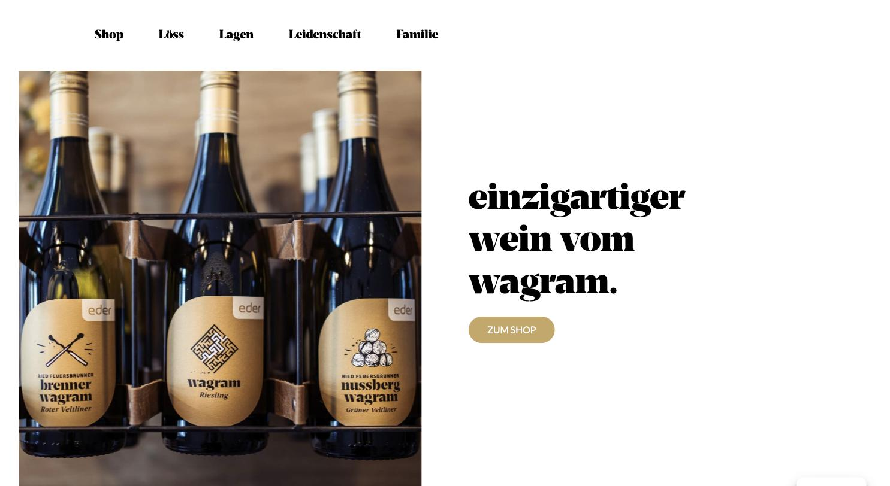
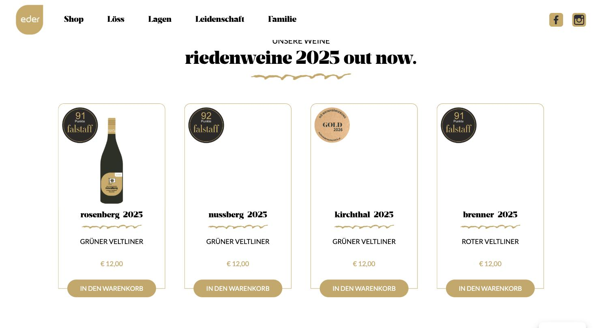

# Weingut Eder

**Gold und fette Serif – handwerklich, nicht luxuriös.**

- URL: https://www.weingut-eder.at/
- Kategorie: Shop / Marke
- Plattform: WordPress + WooCommerce
- Premium-Eignung: 3/5

## Einschätzung

Ein Gold-Ton trägt die gesamte Seite: Logo, Buttons, Zierlinien, Etiketten. Breve Display ist eine fette, charaktervolle Serif, die den Headlines Wucht gibt, Lato hält den Rest neutral. Der Split-Hero (Bild links, Claim rechts) ist gut gelöst. Die Produktkacheln sind mit abgerundeten Rahmen, Falstaff-Punkterosetten, Gold-Medaillen und gezeichneten Schnörkel-Trennern allerdings deutlich überdekoriert – jedes Element will Aufmerksamkeit.

## Farbpalette

| Hex | Rolle |
|---|---|
| `#c8a763` | Gold (Marke) |
| `#000000` | Schwarz |
| `#eae7e3` | Warmgrau |
| `#ffffff` | Weiß |

## Typografie

Schriften: Breve Display (fette Serif) + Lato (Body)

| Rolle | Spezifikation | Beispiel |
|---|---|---|
| H1 | `Breve Display 60/72 px · w400 · schwarz` | einzigartiger wein vom wagram. |
| H3 | `Breve Display 45/54 px · w400` | riedenweine 2025 out now. |
| H2 | `Lato 20/24 px · UPPERCASE` | UNSERE WEINE |
| Body | `Lato 16/28 px · w400` | Fließtext |
| Kicker | `Lato 17/28 px · w500 · UPPERCASE · #c8a763` | Goldene Auszeichnungszeile |

## Layout & Raster

Seitenlänge 3.564 px, Sektions-Padding 64 px. Split-Hero: Bild links bündig, Claim und Button rechts. Produktraster 4-spaltig.

## Bildsprache

11 Bilder, fast alle 1:1. Flaschen im Traggestell, freigestellte Einzelflaschen. Etiketten mit Illustrationen (Streichhölzer, Labyrinth, Nüsse) als Serie.

## Shop / Buchung

Pill-Buttons mit 800 px Radius in Gold, Produktkachel mit Rahmen (r 6 px), Falstaff-Punkterosette, „GOLD 2026“-Medaille, gezeichneter Schnörkel-Trenner, „IN DEN WARENKORB“.

## Bewegung

Einblendungen beim Scrollen.

## Übernehmen

- Split-Hero: Bild randlos links, Claim und CTA rechts im Weißraum
- Illustrierte Etikettenserie als verbindendes Gestaltungselement
- Genau ein Metallton statt Gold plus Bordeaux plus Ornament

## Vermeiden

- Punkterosetten und Medaillen direkt auf der Produktkachel
- Gezeichnete Schnörkel-Trenner unter jedem Produktnamen
- Vollrunde Pill-Buttons (r 800 px) wirken im Premiumsegment weich

## Screenshots

*Split-Hero: Flaschen links randlos, Claim und Gold-Button rechts*

*Produktraster mit Rahmen, Punkterosetten und Schnörkel-Trennern*
