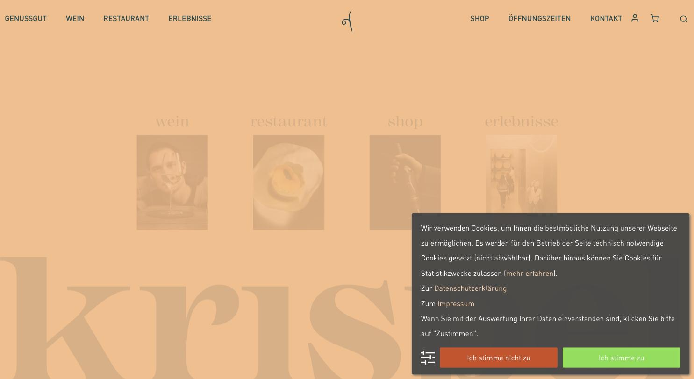
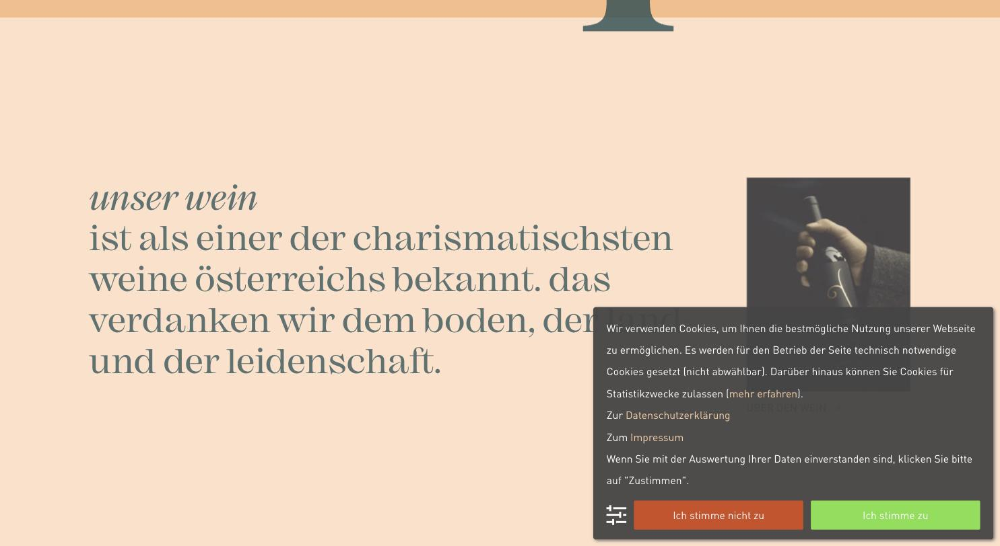

# Genussgut Krispel

**Der gestalterisch stärkste österreichische Auftritt der Liste.**

- URL: https://www.krispel.at/
- Kategorie: Marke / Genussgut
- Plattform: WordPress + WooCommerce, individuell gestaltet
- Premium-Eignung: 5/5

## Einschätzung

Hier hat jemand eine Marke gebaut, keine Website. Aprikose auf Creme mit Petrol als Gegenpol, eine kursive Serif (Mackay) für die emotionalen Zeilen, DIN Pro in 79 px für die lauten, und alles konsequent kleingeschrieben. Der Schriftzug „krispel“ läuft als riesiges Wasserzeichen durch den Hintergrund. Die Navigation ist nach Geschäftsbereichen sortiert – Genussgut, Wein, Restaurant, Erlebnisse – der Shop ist rechts angesetzt, nicht im Zentrum. Genau diese Struktur passt zu einem Weingut mit Verkostung und Gastronomie. Einzige Einschränkung: Die Tonalität ist warm-verspielt, nicht luxuriös – für „premium“ müsste die Farbwelt kühler und dunkler werden.

## Farbpalette

| Hex | Rolle |
|---|---|
| `#fff3e8` | Creme (Grundfläche) |
| `#f9bc88` | Aprikose (Marke) |
| `#fee0c9` | Aprikose hell |
| `#204c52` | Petrol (Typo) |
| `#d04c20` | Orangerot (Akzent) |

## Typografie

Schriften: Mackay (Serif, kursiv für Kicker) + DIN Pro (Headlines und Body)

| Rolle | Spezifikation | Beispiel |
|---|---|---|
| H2 | `DIN Pro 79/84 px · w400 · UPPERCASE · #204c52` | Große Sektionstitel |
| Kicker | `Mackay kursiv · #204c52` | unser wein |
| H3 | `DIN Pro 25/38 px · w500 · UPPERCASE` | Zwischenzeile |
| Body | `DIN Pro 16/24 px · w400 · #204c52` | Fließtext |
| Nav | `DIN Pro 16 px · UPPERCASE · #f9bc88` | GENUSSGUT / WEIN / RESTAURANT |

## Layout & Raster

Volle Breite ohne harten Container, Seitenlänge 11.340 px. Vier Einstiegskacheln direkt unter dem Header (wein / restaurant / shop / erlebnisse), danach großflächige Farbfelder.

## Bildsprache

14 Bilder, überwiegend 3:4 Hochformat, 2 Videos. Menschen bei Tisch, Hände, Detailaufnahmen – durchgehend warme Farbstimmung, sehr konsistent.

## Shop / Buchung

Shop ist gleichrangig, aber nicht dominant. Warenkorb und Konto als Icons rechts, Buttons als Outline mit 1,5 px Linie, keine Flächen.

## Bewegung

Sanfte Parallax-Effekte, Hover-Zoom auf den Einstiegskacheln.

## Übernehmen

- Navigation nach Geschäftsbereichen statt nach Produktkategorien
- Kursive Serif als Kicker über einer großen Grotesk-Zeile
- Konsequente Kleinschreibung als Markenhaltung
- Riesiger Wortmarken-Schriftzug als Hintergrundebene
- Outline-Buttons mit 1,5 px Linie statt gefüllter Flächen

## Vermeiden

- Zwei zusätzliche Farben (Orangerot neben Aprikose) verwässern die Palette leicht
- Cookie-Banner nimmt ein Drittel des Bildschirms ein

## Screenshots

*Vier Einstiegskacheln (wein / restaurant / shop / erlebnisse) über Wortmarken-Wasserzeichen*

*Kursiver Serif-Kicker über großer Grotesk-Zeile, konsequent kleingeschrieben*
