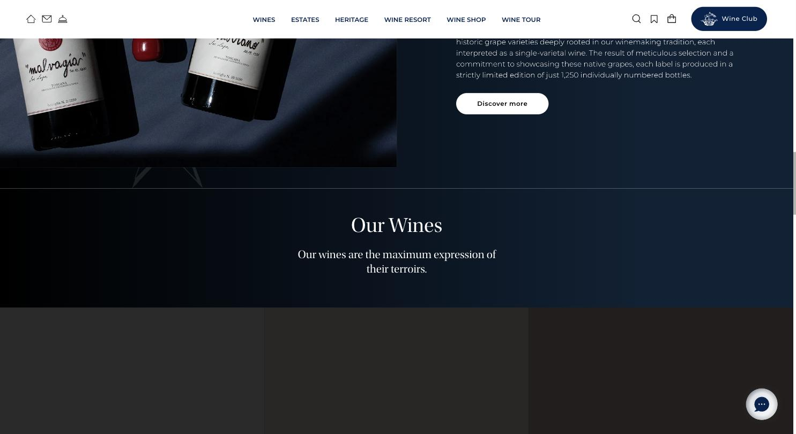
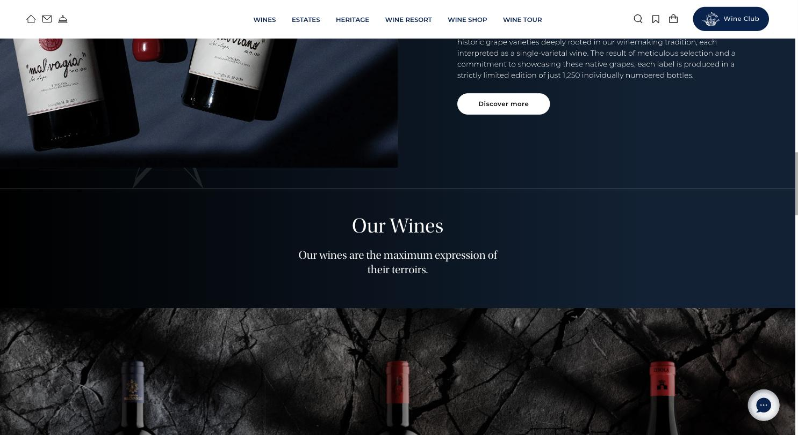
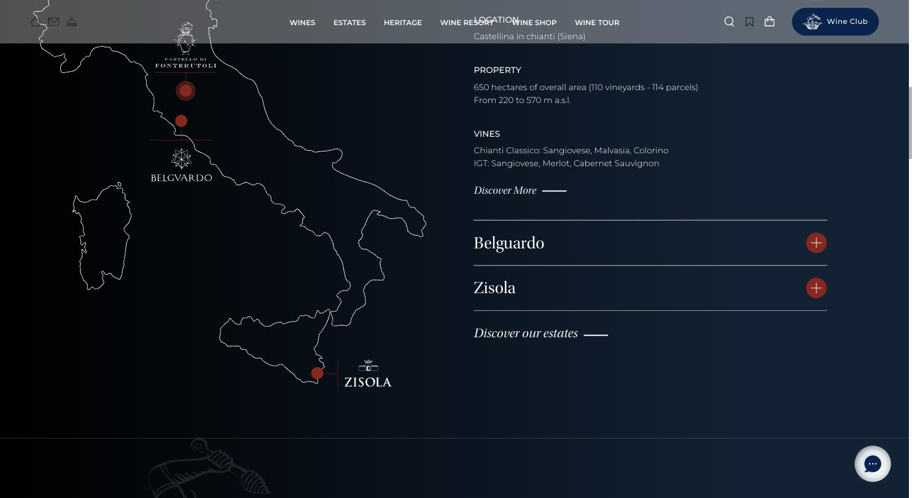

# Mazzei (Toskana)

**Der internationale Premium-Maßstab in dieser Liste.**

- URL: https://eu.mazzei.it/
- Kategorie: Marke premium
- Plattform: Shopify
- Premium-Eignung: 5/5

## Einschätzung

Das ist der Auftritt, an dem sich ein Premium-Weingut messen sollte. Durchgehend dunkles Navy bis Fast-Schwarz, eine hochwertige Display-Serif (Utopia Std Display) für alle Headlines, Montserrat ausschließlich für Funktionales, ein einziger roter Akzent für Interaktion. Die Bildsprache ist kinematografisch: Flaschen auf Stein, dunkle Kellerszenen, alles in derselben kühlen Lichtstimmung. Die Landkarte mit den Gütern ist eine eigene Illustration mit Aufklapp-Logik. Auffällig: Der Shop heißt nicht „Shop“, sondern „Wine Shop“, „Wine Club“, „Wine Tour“, „Wine Concierge“ – Kommerz wird zu Zugehörigkeit umformuliert.

## Farbpalette

| Hex | Rolle |
|---|---|
| `#002450` | Navy (Marke) |
| `#0b1420` | Fast-Schwarz (Sektion) |
| `#c0392b` | Rot (Akzent, Interaktion) |
| `#ffffff` | Weiß (Typo auf dunkel) |
| `#d9d9d9` | Sekundärtext |

## Typografie

Schriften: Utopia Std Display (Serif) + Montserrat (UI/Body)

| Rolle | Spezifikation | Beispiel |
|---|---|---|
| H2 | `Utopia Std Display 31/34 px · w400 · weiß` | Our Wines |
| H3 | `Utopia Std Display 40/42 px · w400 · weiß` | Estate-Titel |
| Body | `Montserrat 16/24 px · w400 · weiß` | Fließtext auf dunklem Grund |
| Nav | `Montserrat 12 px · w600 · UPPERCASE` | WINES / ESTATES / HERITAGE |
| Link | `Utopia Italic + Linie` | Discover More ——— |

## Layout & Raster

Container 1512 px, Vollbild-Sektionen, Seitenlänge 5.714 px. Sehr großzügiger vertikaler Rhythmus, halbseitige Bild/Text-Splits, keine Kachelraster.

## Bildsprache

Video-Hero, dunkle Produktfotografie (Flaschen auf Stein, auf Samt), illustrierte Italienkarte mit Gut-Markern. Konsequent kühle, dunkle Lichtstimmung über die gesamte Seite.

## Shop / Buchung

„Wine Club“ als Navy-Pill (r18 px) fix oben rechts, Wine Shop / Wine Tour / Wine Concierge als eigene Navigationspunkte, Wishlist-Icon, weiße Pill-Buttons „Discover more“ auf dunklem Grund.

## Bewegung

Sanfte Fades beim Scrollen, Akkordeon für die Güter, sonst sehr zurückhaltend.

## Übernehmen

- Dunkle Grundfläche als Markenraum – nicht nur für einzelne Sektionen
- Display-Serif für Headlines, Grotesk ausschließlich für UI
- Kursive Serif-Links mit Strich statt Buttons („Discover More ———“)
- Kommerz sprachlich als Zugehörigkeit: Club, Tour, Concierge statt Shop
- Eigene Kartenillustration für Lagen/Güter

## Vermeiden

- Sehr JS-lastiger Aufbau: Inhalte erscheinen mit spürbarer Verzögerung
- Chat-Widget und Club-Pill gleichzeitig über dem Content

## Screenshots

*„Our Wines“ – Serif-Headline auf Navy, sehr großzügiger Raum*

*Dunkle Produktfotografie: Flaschen auf Stein, gleiche Lichtstimmung*

*Illustrierte Karte der Güter mit Datenblatt und Akkordeon*
