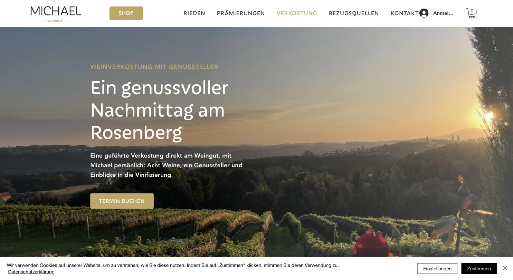

# Weingut Michael — Verkostung

**Emotional richtig aufgebaut, technisch Baukasten.**

- URL: https://www.weingut-michael.at/verkostung
- Kategorie: Erlebnis / Buchung
- Plattform: Wix
- Premium-Eignung: 3/5

## Einschätzung

Die Verkostungsseite macht inhaltlich vieles richtig: goldener Kicker („WEINVERKOSTUNG MIT GENUSSTELLER“), große Headline mit Ortsbezug („Ein genussvoller Nachmittag am Rosenberg“), ein Satz, der konkret sagt was enthalten ist – acht Weine, ein Genussteller, Einblicke in die Vinifizierung – und genau ein Button „TERMIN BUCHEN“. Das Abendlicht-Panorama über die volle Breite trägt die Stimmung. Schwächer ist die Umsetzung: Wix-Baukasten, generische Schriftreferenzen, Gold als einziger Marken-Anker.

## Farbpalette

| Hex | Rolle |
|---|---|
| `#bfa760` | Gold (Marke) |
| `#fcf8ed` | Creme |
| `#7d9174` | Salbeigrün |
| `#303030` | Text |
| `#ffffff` | Weiß |

## Typografie

Schriften: Wix-Serif (Headlines) + Avenir LT Light (Body)

| Rolle | Spezifikation | Beispiel |
|---|---|---|
| H1 | `Serif 60/66 px · w400 · #bfa760` | Ein genussvoller Nachmittag am Rosenberg |
| H3 | `Serif 45/54 px · w400 · Gold` | Zwischentitel |
| Body | `Avenir LT Light 18/29 px · #303030` | Beschreibungstext |
| Kicker | `Gesperrte Versalien · Gold` | WEINVERKOSTUNG MIT GENUSSTELLER |

## Layout & Raster

Seitenlänge 5.133 px. Vollbild-Hero mit Abendlicht-Panorama, Textblock linksbündig auf ca. 40 % Breite, ein Button.

## Bildsprache

Abendliches Weingartenpanorama als Hero. Wenige weitere Bilder.

## Shop / Buchung

Goldener Button „TERMIN BUCHEN“ (r 5 px), Shop-Button separat im Header, Warenkorb und Login rechts.

## Bewegung

Wix-Standard.

## Übernehmen

- Kicker + Headline mit Ortsbezug + ein konkreter Inhaltssatz + genau ein Button
- Leistungsumfang wörtlich benennen: acht Weine, ein Genussteller, Einblicke in die Vinifizierung
- Linksbündiger Textblock auf 40 % Breite über Vollbild-Panorama
- Verkostung als eigener Hauptnavigationspunkt, nicht unter „Kontakt“

## Vermeiden

- Gold als einziger Markenanker ohne zweite Farbe
- Sichtbare Baukasten-Struktur
- Login-Avatar überlappt den Menüpunkt „KONTAKT“

## Screenshots

*Verkostungs-Hero: goldener Kicker, Headline mit Ortsbezug, ein Buchungs-Button*
