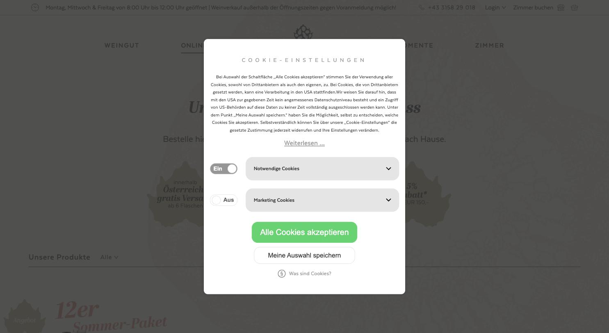
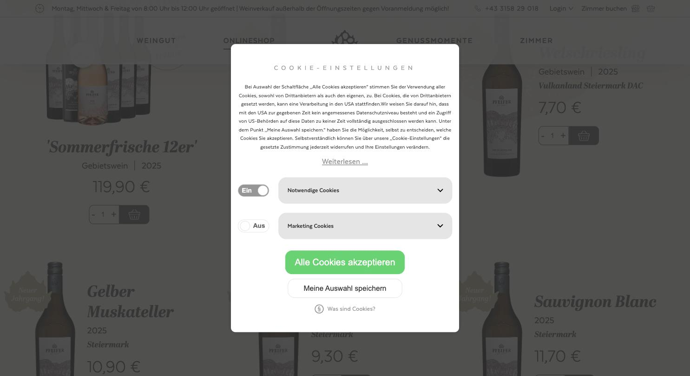

# Weingut Pfeifer

**Funktionierender Shop, Optik aus dem Rabatt-Repertoire.**

- URL: https://www.pfeifer-weingut.at/onlineshop.html
- Kategorie: Shop
- Plattform: Individueller Shop, sehr lange Seite
- Premium-Eignung: 2/5

## Einschätzung

Sandfarbene Fläche, Abril Display als Headline-Serif und eine schmale Grotesk – die Zutaten sind nicht schlecht. Der Auftritt kippt aber durch die Menge an Verkaufssignalen: Aktions-Rosetten, „Neuer Jahrgang!“-Fahnen, Gratisversand-Störer, Rabattbanner, dazu eine 10.500 px lange Seite. Die Flaschen sind freigestellt vor Sandfläche montiert, wodurch der Grid wie ein Katalog wirkt. Als Mechanik-Referenz brauchbar, als Gestaltungsreferenz nicht.

## Farbpalette

| Hex | Rolle |
|---|---|
| `#e4dec5` | Sand |
| `#333333` | Text |
| `#4a4949` | Sekundärtext |
| `#ffffff` | Weiß |
| `#e5e5e5` | Fläche |

## Typografie

Schriften: Abril Display (Serif) + Texta (Grotesk)

| Rolle | Spezifikation | Beispiel |
|---|---|---|
| H1 | `Abril Display 40/40 px · w700 · #333` | Unser Onlineshop |
| H2 | `Abril Display 35/46 px · w700` | Sektionstitel |
| H3 | `Abril Display 18/23 px · w800` | Produktname |
| Body | `Texta 20 px · w400` | Fließtext |
| Nav | `Texta 18 px · w700 · ls 2 px · UPPERCASE` | WEINGUT / ONLINESHOP |

## Layout & Raster

Container 1400 px, Radius 10 px, Seitenlänge 10.510 px. Topbar mit Öffnungszeiten, Telefonnummer, Login und „Zimmer buchen“. Produktraster 4-spaltig.

## Bildsprache

14 Bilder, überwiegend 3:4. Freigestellte Flaschen, Blattornamente als Wasserzeichen im Hintergrund.

## Shop / Buchung

Preis, Mengen-Stepper und Warenkorb-Icon direkt in der Kachel. Aktionsrosetten („12er Sommer-Paket“, „-5 % Rabatt ab EUR 150“), Gratisversand-Störer, Jahrgangsfahnen.

## Bewegung

Kaum Bewegung.

## Übernehmen

- Mengen-Stepper direkt in der Produktkachel (funktioniert gut für 6er/12er-Gebinde)
- Öffnungszeiten und Telefon in der Topbar – für Ab-Hof-Verkauf sinnvoll

## Vermeiden

- Aktions-Rosetten und Störer über den Flaschen
- Grellgrüner Cookie-Button, der alles andere übertönt
- Blattornamente als Hintergrund-Wasserzeichen
- Seiten über 10.000 px Länge ohne Zwischennavigation

## Screenshots

*Einstieg mit Sandfläche, Blattornamenten und Cookie-Dialog*

*Produktraster mit freigestellten Flaschen, Aktionsrosetten und Steppern*
