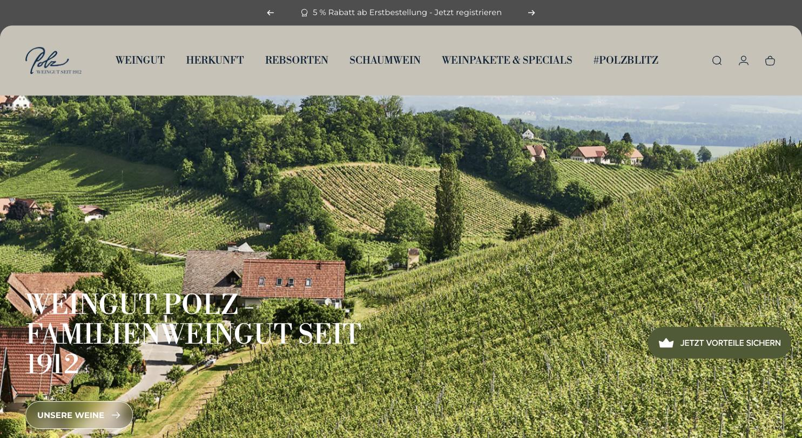
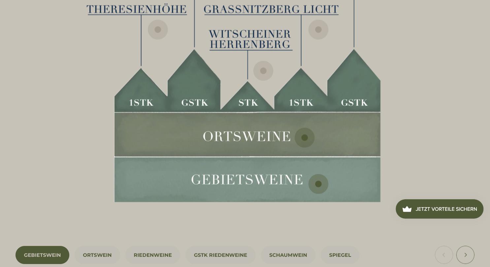

# Weingut Polz

**Der beste E-Commerce-Auftritt der österreichischen Liste.**

- URL: https://weingutpolz.at/
- Kategorie: Marke + Shop
- Plattform: Shopify
- Premium-Eignung: 4/5

## Einschätzung

Sauber gebaute Shopify-Seite mit echtem Gestaltungswillen: Sandton als Grundfläche, Tiefseeblau für Typo, Olivgrün als dritte Farbe. Libre Bodoni gibt den Headlines Charakter, Montserrat hält die Oberfläche neutral. Herausragend ist die illustrierte Lagenpyramide – ein eigenes, gezeichnetes Erklärstück statt Stockmaterial. Abgezogen wird für die Stapelung aus Altersabfrage, Cookie-Banner und Treueprogramm-Badge sowie die sehr präsente Rabattkommunikation.

## Farbpalette

| Hex | Rolle |
|---|---|
| `#c7c2b7` | Sand (Grundfläche) |
| `#0a2237` | Tiefseeblau (Typo) |
| `#4f5a32` | Olivgrün (Sektion) |
| `#ffffff` | Weiß |
| `#171717` | Fast-Schwarz |

## Typografie

Schriften: Libre Bodoni (Display) + Montserrat (UI/Body)

| Rolle | Spezifikation | Beispiel |
|---|---|---|
| H1 | `Libre Bodoni 51/51 px · w400 · UPPERCASE · weiß` | WEINGUT POLZ – FAMILIENWEINGUT SEIT 1912 |
| H2 | `Libre Bodoni 22/22 px · w400 · UPPERCASE · #0a2237` | Sektionstitel |
| Body | `Montserrat 15/19 px · w400` | Fließtext |
| Nav | `Montserrat 15 px · UPPERCASE` | WEINGUT / HERKUNFT / REBSORTEN |

## Layout & Raster

Container 1280 px, Sektions-Padding 72 / 36 px, Seitenlänge 8.828 px. Sticky Announcement-Bar über dem Header, Header in Sandfläche, danach Vollbild-Landschaftsbild mit Headline unten links.

## Bildsprache

18 Bilder, fast ausschließlich 1:1. Vollbild-Weingartenpanorama als Hero. Highlight: handgezeichnete/aquarellierte Lagenpyramide (Gebietswein → Ortswein → Riedenwein → GSTK).

## Shop / Buchung

Warenkorb + Konto im Header, Pill-Buttons mit 60 px Radius, Filter-Chips für Weinkategorien, Treueprogramm-Badge „JETZT VORTEILE SICHERN“ fix unten rechts, Announcement „5 % Rabatt ab Erstbestellung“.

## Bewegung

Karussell mit Pfeil-Steuerung, sanfte Hover-States, sonst ruhig.

## Übernehmen

- Sandfarbene Grundfläche statt Weiß – wirkt sofort wertiger
- Eigene Illustration für die Lagenpyramide statt Foto oder Tabelle
- Display-Serif nur für Headlines, Grotesk für alles Funktionale
- Filter-Chips als ruhige Pills statt Dropdown-Wüste

## Vermeiden

- Drei Overlays hintereinander (Alter, Cookies, Treueprogramm)
- Rabatt als erste Botschaft in der Announcement-Bar
- Dauerhaft sichtbares Loyalty-Badge über dem Content

## Screenshots

*Hero: Sand-Header, Vollbild-Weingarten, Bodoni-Headline unten links*

*Illustrierte Lagenpyramide mit Filter-Chips darunter*
