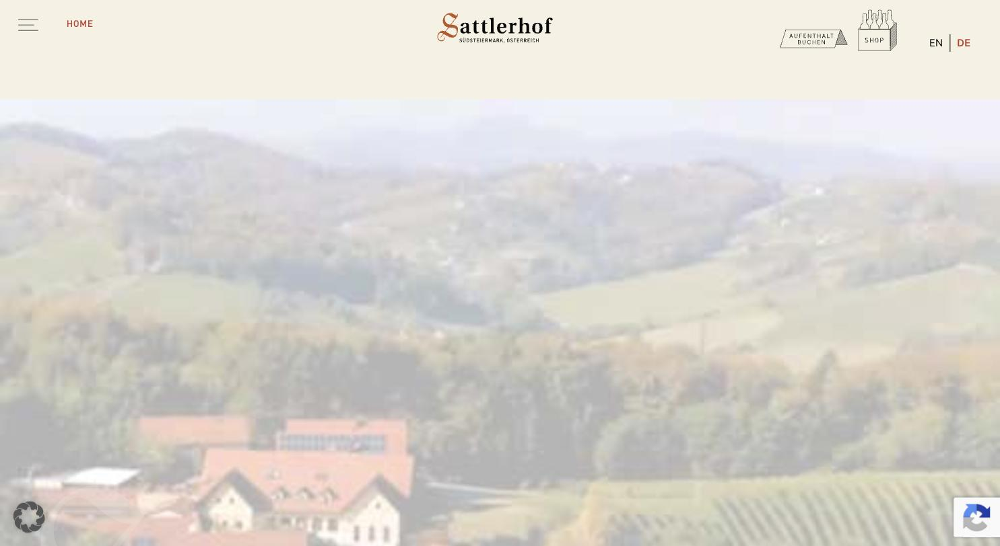
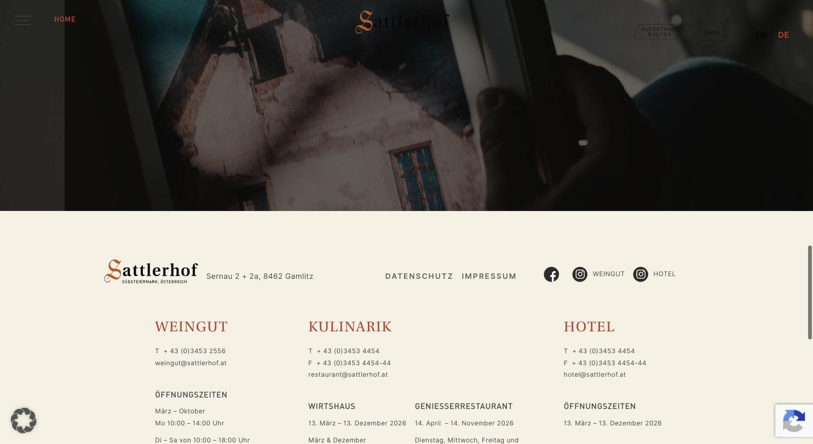

# Sattlerhof

**Gastgeber-Auftritt: Weingut, Restaurant und Hotel unter einer Marke.**

- URL: https://sattlerhof.at/
- Kategorie: Marke / Gastgeber
- Plattform: WordPress + Bootstrap, Borlabs Cookie
- Premium-Eignung: 4/5

## Einschätzung

Der ruhigste österreichische Auftritt der Liste. Cremeweiße Grundfläche, ein einziger warmer Ziegelrot-Akzent, mittig gesetzte Wortmarke, Hamburger links, Buchen- und Shop-Icon als handgezeichnete Stempel rechts. Die Seite ist als animierter One-Pager gebaut und erzählt Weingut, Kulinarik und Hotel gleichwertig – genau das Modell, das für ein Weingut mit Verkostung und Gastronomie funktioniert. Größte Schwäche: eine harte Consent-Wall blockiert den Zugang komplett, und der Fließtext ist mit 12 px zu klein.

## Farbpalette

| Hex | Rolle |
|---|---|
| `#f5f1e2` | Creme (Grundfläche) |
| `#fff1df` | Warmes Creme |
| `#c03a2c` | Ziegelrot (Akzent) |
| `#212529` | Fast-Schwarz |
| `#4a4a4a` | Body-Grau |
| `#626262` | Sekundärtext |

## Typografie

Schriften: Utopia (Serif, Labels) + DIN (Headlines) + Inter (Body)

| Rolle | Spezifikation | Beispiel |
|---|---|---|
| H2 | `DIN 26/35 px · w600 · UPPERCASE · #212529` | WEINGUT / KULINARIK / HOTEL |
| H3 | `Utopia 28/33 px · w500 · ls 1.5 px · UPPERCASE · #c03a2c` | Roter Serif-Kicker |
| Body | `Inter 12/22 px · w400 · ls 0.4 px · #4a4a4a` | Fließtext (deutlich zu klein) |

## Layout & Raster

Bootstrap-Container 1140 px, Seitenlänge 3.825 px. Mittig gesetzte Wortmarke, Navigation hinter Hamburger, Sprache und Buchungs-Icons rechts. Scroll-animierter One-Pager.

## Bildsprache

Wenige, dafür sehr große Motive: Vollbild-Landschaft über dem Hof, Videosequenzen, Food-Stillleben. Einheitlich warme, leicht entsättigte Farbstimmung.

## Shop / Buchung

Kein Shop im Vordergrund. Stattdessen zwei gleichrangige Icon-Buttons: „AUFENTHALT BUCHEN“ und „SHOP“ – beide als handgezeichnete Stempel. Auszeichnungsleiste im Footer (Michelin, Gault&Millau, Falstaff, Respekt).

## Bewegung

Starke Scroll-Choreografie mit Ein- und Ausblendungen, teilweise Scroll-Jacking.

## Übernehmen

- Drei Geschäftsbereiche gleichwertig im Footer und in der Navigation
- Genau ein warmer Akzentton auf cremeweißem Grund
- Handgezeichnete Icons statt Standard-Piktogramme
- Auszeichnungsleiste als ruhige Monochrom-Reihe, nicht als bunte Badges

## Vermeiden

- Consent-Wall, die den Zugang zur Seite komplett blockiert
- 12 px Fließtext
- Scroll-Animation, die das Zurückscrollen unberechenbar macht

## Screenshots

*Header: mittige Wortmarke, Hamburger links, Buchen/Shop-Stempel rechts*

*Footer mit drei gleichrangigen Bereichen Weingut / Kulinarik / Hotel*
