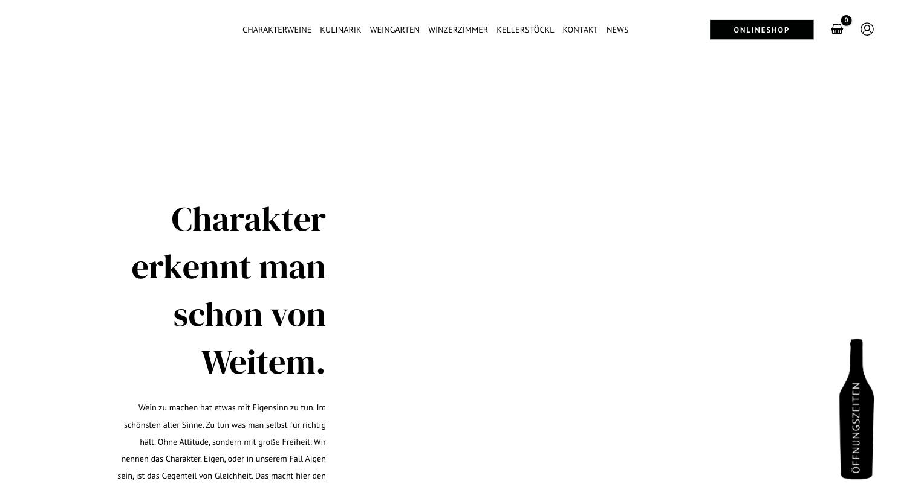
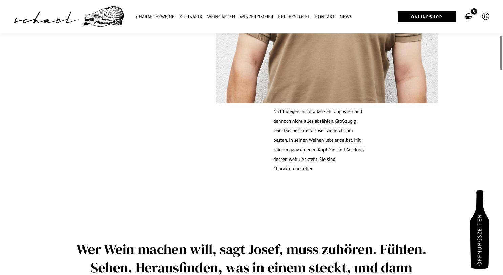

# Weinhof Scharl

**Reines Schwarzweiß, Magazinlogik – überraschend stark.**

- URL: https://weinhof-scharl.at/
- Kategorie: Marke / Editorial
- Plattform: WordPress + Elementor + WooCommerce
- Premium-Eignung: 4/5

## Einschätzung

Kein einziger Farbton außer Schwarz und Weiß. DM Serif Display trägt die gesamte Erzählung, PT Sans hält den Rest neutral. Der Aufbau folgt einem Magazin: schmale zentrierte Textspalte, große Serif-Zitate über die volle Breite, versetztes Bildraster mit Hochformaten. Die gezeichnete Schiebermütze als Bildmarke gibt der Marke ein Gesicht, ohne folkloristisch zu werden. Der senkrechte „Öffnungszeiten“-Reiter in Flaschenform am rechten Rand ist eine eigenständige, charmante Lösung.

## Farbpalette

| Hex | Rolle |
|---|---|
| `#000101` | Schwarz |
| `#ffffff` | Weiß |
| `#fafafa` | Grauweiß |
| `#5f5f5f` | Sekundärtext |

## Typografie

Schriften: DM Serif Display (Headlines) + PT Sans (Body/Nav)

| Rolle | Spezifikation | Beispiel |
|---|---|---|
| H1 | `DM Serif Display 58/81 px · w400 · schwarz` | Charakter erkennt man schon von Weitem. |
| H2 | `DM Serif Display 42/55 px · w400` | Zitatzeile über volle Breite |
| H3 | `DM Serif Display 32/42 px · w400` | Zwischentitel |
| Body | `PT Sans 14/29 px · w400` | Fließtext, sehr großzügige Zeilenhöhe |
| Nav | `PT Sans 14 px · w500 · UPPERCASE` | CHARAKTERWEINE / KULINARIK |

## Layout & Raster

Container 1200 px, Seitenlänge 6.306 px. Zentrierte schmale Textspalte im Hero, danach versetztes Bildraster, dazwischen ganzseitige Serif-Zitate.

## Bildsprache

11 Bilder, 16:9 und 3:4 gemischt. Reportagefotografie: Person vor Wand, Hände mit Trauben, Architektur in der Landschaft. Sehr einheitliche, helle Bildstimmung.

## Shop / Buchung

Schwarzer „ONLINESHOP“-Button im Header, Warenkorb- und Konto-Icon daneben. Senkrechter Öffnungszeiten-Reiter in Flaschenform am rechten Bildrand.

## Bewegung

Sparsam, Einblendungen beim Scrollen.

## Übernehmen

- Konsequentes Schwarzweiß – funktioniert, wenn die Fotografie stark ist
- Ganzseitige Serif-Zitate als Rhythmuswechsel zwischen Bildstrecken
- Gezeichnete Bildmarke statt Wappen oder Trauben
- Versetztes Bildraster statt gleichförmiger Kacheln
- Zeilenhöhe 29 px bei 14 px Schrift – sehr ruhiger Lesefluss

## Vermeiden

- 14 px Fließtext ist an der unteren Grenze
- Consent-Layer, der ein Drittel der Seite einnimmt

## Screenshots

*Zentrierte Serif-Headline, schmale Textspalte, Flaschen-Reiter rechts*

*Editoriales Bild-Text-Layout mit versetztem Raster*
